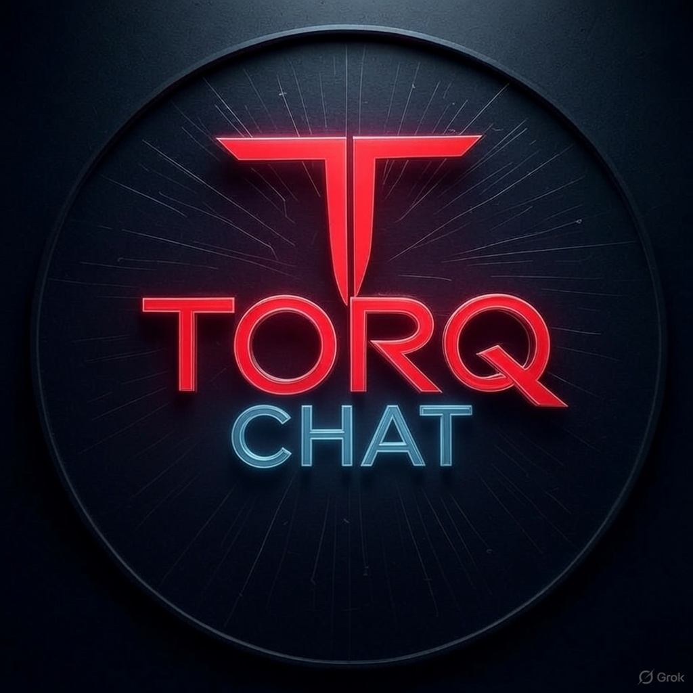

# TORQ Chat

Specialized AI consultants for strategy, code, legal, retirement, marketing, finance, and operations — powered by **Claude** via the **TORQ Chat BFF** (no API keys in the browser).



## Architecture (Phase 1 + Phase 2)

```
Browser / iOS WKWebView  →  TORQ BFF  →  Anthropic API
  session token              holds ANTHROPIC_API_KEY
  local chat history
  VITE_TORQ_API_BASE only
```

The web/iOS client never receives or bundles `ANTHROPIC_API_KEY`. It obtains a short-lived session token from the BFF and streams chat over SSE.

Phase 2 wraps the Vite production build with **Capacitor** for iOS (`com.torq.chat` / **TORQ Chat**).

## Two-process local development

You need **two terminals**.

### Terminal 1 — BFF server (port 8787)

```bash
# From the server project (separate agent / package holds the key)
# Example once server/ exists in this monorepo:
cd server   # or wherever the BFF lives
# Set ANTHROPIC_API_KEY in the server's .env only
npm run dev   # listens on http://localhost:8787
```

### Terminal 2 — Vite web client (port 3000)

```bash
cd E:\torq-chatbot
npm install
# Optional: copy .env.example → .env and set VITE_TORQ_API_BASE
npm run dev
```

Open [http://localhost:3000](http://localhost:3000).

| Process | Default URL | Secrets |
|---------|-------------|---------|
| Vite client | http://localhost:3000 | None (only `VITE_TORQ_API_BASE`) |
| TORQ BFF | http://localhost:8787 | `ANTHROPIC_API_KEY` (server-only) |

## Scripts

| Command | Purpose |
|---------|---------|
| `npm run dev` | Vite dev server (client) |
| `npm test` | Vitest (unit + component; excludes `server/`) |
| `npm run build` | Production build → `dist/` |
| `npm run lint` | ESLint |
| `npm run format` | Prettier |
| `npm run cap:sync` | `build` + `npx cap sync` (web → native) |
| `npm run cap:ios` | Open Xcode iOS project (`npx cap open ios`) |
| `npm run cap:add:ios` | Create iOS platform once (`npx cap add ios`) |

## Phase 2 — iOS (Capacitor)

| Item | Value |
|------|--------|
| Bundle ID | `com.torq.chat` |
| App name | TORQ Chat |
| Web assets | `dist/` (`webDir`) |
| Config | [`capacitor.config.ts`](capacitor.config.ts) |
| Native init | [`native.ts`](native.ts) (StatusBar, Keyboard, App, SplashScreen) |
| Safe areas | [`index.css`](index.css) + `viewport-fit=cover` |
| Full Mac guide | [`docs/IOS-SETUP.md`](docs/IOS-SETUP.md) |
| Info.plist notes | [`docs/ios/Info.plist.notes.md`](docs/ios/Info.plist.notes.md) |
| App icon source | `public/torq-chat-logo.jpg` |

### Quick path (macOS + Xcode for run/sign/TestFlight)

```bash
npm install
# Production/staging BFF URL (never Anthropic keys):
export VITE_TORQ_API_BASE=https://your-bff.example.com
npm run build
npx cap add ios          # once if ios/ missing (works on Windows too for scaffold)
npm run cap:sync
npm run cap:ios          # Mac: Xcode → sign → run / Archive → TestFlight
# Capacitor 8 plugins use Swift Package Manager (Xcode resolves on open).
# CocoaPods only if you add pod-based plugins later.
```

### Windows note

On Windows you can install Capacitor, scaffold `ios/` (`npx cap add ios`), build `dist/`, and `cap sync`. **Xcode, Simulator, signing, Archive, and TestFlight require a Mac** (`cap doctor` will report Xcode missing). See [docs/IOS-SETUP.md](docs/IOS-SETUP.md).

## Product notes

- **8 consultants** with distinct system prompts (persona applied server-side / by consultant id).
- **Streaming** chat via BFF SSE (`data: {"type":"delta","text":"..."}`).
- **History** per consultant in `localStorage` (`torq-chat-history-v1`).
- **Session** token in `localStorage` (`torq-chat-session-v1`).
- **Export** conversations as Markdown.
- **Shortcuts:** `Ctrl/⌘+Shift+O` new chat · Enter send · Shift+Enter newline.
- **Legal:** [/privacy.html](/privacy.html) · [/terms.html](/terms.html) · [/support.html](/support.html)
- **No microphone** usage in Phase 2 (metadata permissions cleared).

## Security

- **Do not** put `ANTHROPIC_API_KEY` in client `.env` with a `VITE_` prefix or in `vite.config.ts` `define`.
- Server holds the model key; client holds only a session token from `POST /v1/session`.
- CSP allows connecting to the BFF (`localhost:8787` / `127.0.0.1:8787`) and HTTPS origins (production BFF + Capacitor).

## Stack

React 19 · TypeScript · Vite 6 · Tailwind 4 · Capacitor 8 · TORQ BFF (SSE) · Vitest · Testing Library
